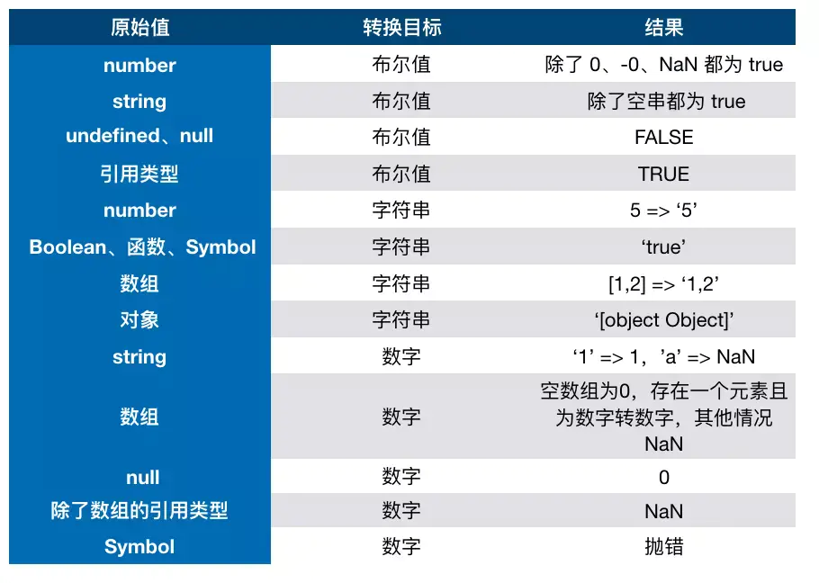

### 类型转换
其实，js 在底层存储变量的时候，会在变量的机器码的低位1-3位存储其类型信息👉

000：对象
010：浮点数
100：字符串
110：布尔
1：整数

but, 对于 undefined 和 null 来说，这两个值的信息存储是有点特殊的。
null：所有机器码均为0
undefined：用 −2^30 整数来表示
所以，typeof 在判断 null 的时候就出现问题了，由于 null 的所有机器码均为0，因此直接被当做了对象来看待。

#### 相等比较
1. ==
2. ===
3. Object.is()
```js
// 这些情况在不同 JavaScript 引擎中表现不同，但仍被认为相等
console.log(+0 === -0); // true
console.log(+0 === 0); // true
console.log(-0 === 0); // true
// 要确定 NaN 的相等性，必须使用极为讨厌的 isNaN()
console.log(NaN === NaN); // false
console.log(isNaN(NaN)); // true 


// 为改善这类情况，ECMAScript 6 规范新增了 Object.is()，这个方法与===很像，但同时也考虑
// 到了上述边界情形。这个方法必须接收两个参数：
console.log(Object.is(true, 1)); // false
console.log(Object.is({}, {})); // false
console.log(Object.is("2", 2)); // false
// 正确的 0、-0、+0 相等/不等判定
console.log(Object.is(+0, -0)); // false
console.log(Object.is(+0, 0)); // true
console.log(Object.is(-0, 0)); // false
// 正确的 NaN 相等判定
console.log(Object.is(NaN, NaN)); // true
```


#### 2. JS中类型转换有哪几种？
- 转换成数字
- 转换成布尔值
- 转换成字符串



### 4. 对象转原始类型是根据什么流程运行的？

我们总结一下，当我们用 String 方法转化一个值的时候，如果是基本类型，就参照 “原始值转字符” 这一节的对应表，如果不是基本类型，我们会将调用一个 ToPrimitive 方法，将其转为基本类型，然后再参照“原始值转字符” 这一节的对应表进行转换。

其实，从对象到数字的转换也是一样：

| 参数类型 | 结果                                                         |
| -------- | ------------------------------------------------------------ |
| Object   | 1. primValue = ToPrimitive(input, Number) 2. 返回ToNumber(primValue)。 |

| 参数类型 | 结果                                                         |
| -------- | ------------------------------------------------------------ |
| Object   | 1. primValue = ToPrimitive(input, String) 2. 返回ToString(primValue). |

```js
ToPrimitive(input[, PreferredType])
```


第一个参数是 input，表示要处理的输入值。

第二个参数是 PreferredType，非必填，表示希望转换成的类型，有两个值可以选，Number 或者 String。

如果是 ToPrimitive(obj, Number)，处理步骤如下：

1. 如果 obj 为 基本类型，直接返回
2. 否则，调用 valueOf 方法，如果返回一个原始值，则 JavaScript 将其返回。
3. 否则，调用 toString 方法，如果返回一个原始值，则 JavaScript 将其返回。
4. 否则，JavaScript 抛出一个类型错误异常。

如果是 ToPrimitive(obj, String)，处理步骤如下：

1. 如果 obj为 基本类型，直接返回
2. 否则，调用 toString 方法，如果返回一个原始值，则 JavaScript 将其返回。
3. 否则，调用 valueOf 方法，如果返回一个原始值，则 JavaScript 将其返回。
4. 否则，JavaScript 抛出一个类型错误异常

**最后**

对象转原始类型，会调用内置的[ToPrimitive]函数，对于该函数而言，其逻辑如下：

1. 如果Symbol.toPrimitive()方法，优先调用再返回
2. 调用valueOf()，如果转换为原始类型，则返回
3. 调用toString()，如果转换为原始类型，则返回
4. 如果都没有返回原始类型，会报错

```js
let o1 = {
  value: 3,
  // valueOf() {
  //   return this.value
  // },
  toString() {
    return '5'
  }
  // [Symbol.toPrimitive]() {
  //   return 6
  // }
};

console.log(+o1) // 5
```

### 5. 如何让if(a == 1 && a == 2)条件成立？

```js
let o2 = {
  value: 0,
  valueOf() {
    return ++this.value
  }
}

console.log(o2 == 1 && o2 == 2) // true
```

