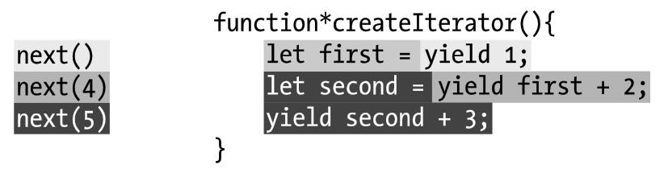

promise自问

1. 怎么处理错误？
2. 如何并发请求？
3. 什么情况会出现错误/失败？
4. Promise.then()带返回值/不带返回值/抛出异常的区别？
5. catch与Promise onRejected函数处理的先后顺序的区别？

Iterator/Generator自问

1. 什么是迭代器？
2. 什么是生成器？
3. 生成器的执行步骤？
4. yield的使用边界？// yield关键字确实在createIterator()函数内部，但是它与return关键字一样，二者都不能穿透函数边界*
5. 委托生成器，yield与yield*的区别？ // 用于委托给另一个[`generator`](https://developer.mozilla.org/zh-CN/docs/Web/JavaScript/Reference/Statements/function*) 或可迭代对象。



```js
function *createInterator() {
   let first = yield 100;
   console.log(first) // 4
   let second = yield first + 2;
   console.log(second) // 5
   yield first + second
  }
  let iterator = createInterator()
  console.log(iterator.next())
  console.log(iterator.next(4))
  console.log(iterator.next(5))
  console.log(iterator.next())
```

第一个iterator的next不用传参，因为next传参是**代替上一个yield的语句返回值**，另外如果不给next传参，first是不会有值的。

执行第一个next，无论传入什么都会被丢弃，因为第一个next执行之前，没有yield语句。

第二次执行next传入4，会代替变量first

下午计划完成Promise、神三元》32篇所有内容

### 【Promise 的含义】

`Promise`对象有以下两个特点。`Promise`对象代表一个异步操作，有三种状态：`pending`（进行中）、`fulfilled`（已成功）和`rejected`（已失败）。

（1）对象的状态不受外界影响。

（2）一旦状态改变，就不会再变，任何时候都可以得到这个结果

### 【基本用法】


### 【Promise.prototype.then()】

`then`方法返回的是一个新的`Promise`实例，如果有返回值就把返回值当做resolve()的参数，如果没有就是undefined

### 【Promise.prototype.catch()】

`Promise.prototype.catch()`方法是`.then(null, rejection)`或`.then(undefined, rejection)`的别名，用于指定发生错误时的回调函数。

```js
p.then((val) => console.log('fulfilled:', val))
  .catch((err) => console.log('rejected', err));

// 等同于
p.then((val) => console.log('fulfilled:', val))
  .then(null, (err) => console.log("rejected:", err));
```

```javascript
Promise.resolve()
.catch(function(error) {
  console.log('oh no', error);
})
.then(function() {
  console.log('carry on');
});
```

上面的代码因为没有报错，跳过了`catch()`方法，直接执行后面的`then()`方法。此时，要是`then()`方法里面报错，就与前面的`catch()`无关了。

### 【Promise.prototype.finally()】

不管`promise`最后的状态，在执行完`then`或`catch`指定的回调函数以后，都会执行`finally`方法指定的回调函数。

`finally`方法的**回调函数不接受任何参数**，这意味着没有办法知道，前面的 Promise 状态到底是`fulfilled`还是`rejected`。这表明，`finally`方法里面的操作，应该是与状态无关的，不依赖于 Promise 的执行结果。

```js
Promise.resolve(2).finally((res) => {
  console.log(res)
}).then(res => {
  console.log(res) // 2
})
```

从上面的实现还可以看到，`finally`方法总是会返回原来的值。

Promise.finally实现

```js
Promise.prototype.finally = function (callback) {
  let P = this.constructor;
  return this.then(
    value  => P.resolve(callback()).then(() => value),
    reason => P.resolve(callback()).then(() => { throw reason })
  );
};
```


### 【Promise.all()】

接受一个数组，数组每一项都是Promise，否则用Promise.resolve(item)转换。全都resolve才resolve,否则一个reject就直接reject了。resolve的结果是一个数组。

注意，如果作为参数的 Promise 实例，自己定义了`catch`方法，那么它一旦被`rejected`，并不会触发`Promise.all()`的`catch`方法。

```js
const p1 = new Promise((resolve, reject) => {
  resolve('hello');
})
.then(result => result)
.catch(e => e);

const p2 = new Promise((resolve, reject) => {
  throw new Error('报错了');
})
.then(result => result)
.catch(e => e);

Promise.all([p1, p2])
  .then(result => console.log(result)) // // ["hello", Error: 报错了]
  .catch(e => console.log(e));
```

`p1`会`resolved`，`p2`首先会`rejected`，但是`p2`有自己的`catch`方法，该方法返回的是一个新的 Promise 实例，`p2`指向的实际上是这个实例。该实例执行完`catch`方法后，也会变成`resolved`，导致`Promise.all()`方法参数里面的两个实例都会`resolved`，因此会调用`then`方法指定的回调函数，而不会调用`catch`方法指定的回调函数。

### 【Promise.race()】

一个成功或者失败即可。

### 【Promise.allSettled()】

`Promise.allSettled()`方法接受一组 Promise 实例作为参数，包装成一个新的 Promise 实例。只有等到所有这些参数实例都返回结果，不管是`fulfilled`还是`rejected`，包装实例才会结束。

```js
const promises = [1, 2, 3, 4].map(v => {
  return new Promise((resolve, reject) => {
    if (v === 3) {
      setTimeout(() => {
        // console.log(v)
        reject(v)
      }, v * 1000)
    } else {
      setTimeout(() => {
        // console.log(v)
        resolve(v)
      }, v * 1000)
    }
  })
})

Promise.allSettled(promises).then(res => {
  console.log(res) // 一个数组，两个属性status代表状态，value代表值
  // 0: {status: "fulfilled", value: 1}
  // 1: {status: "fulfilled", value: 2}
  // 2: {status: "rejected", reason: 3}
 	// 3: {status: "fulfilled", value: 4}
  
}).catch(e => {
  console.log(e)
})
```

有时候，我们不关心异步操作的结果，只关心这些操作有没有结束。这时，`Promise.allSettled()`方法就很有用。如果没有这个方法，想要确保所有操作都结束，就很麻烦。`Promise.all()`方法无法做到这一点。

### 【Promise.any()】

与Promise.all()相反，全部失败才失败，一个成功就行

*// 【Promise.resolve()】*

*// 【Promise.reject()】*

*// 【应用】*

*// 【Promise.try()】*


### 实现一个Promise

一个完整的promise需要哪些属性/方法

```js
let a = new Promise((resolve, reject) => {
  resolve(2)
})
a.then(res => {
  console.log(res)
}, err => {
  console.log(err)
})

```

1. 一个status："peding/fulfilled/rejected"
2. error属性
3. value属性
4. onFulfilled方法
5. onRejected方法
6. resolve函数
7. reject函数

### async

任何一个`await`语句后面的 Promise 对象变为`reject`状态，那么整个`async`函数都会中断执行。

```javascript
async function f() {
  await Promise.reject('出错了');
  await Promise.resolve('hello world'); // 不会执行
}
```

上面代码中，第二个`await`语句是不会执行的，因为第一个`await`语句状态变成了`reject`。

有时，我们希望即使前一个异步操作失败，也不要中断后面的异步操作。这时可以将第一个`await`放在`try...catch`结构里面，这样不管这个异步操作是否成功，第二个`await`都会执行。

```javascript
async function f() {
  try {
    await Promise.reject('出错了');
  } catch(e) {
  }
  return await Promise.resolve('hello world');
}

f()
.then(v => console.log(v))
// hello world
```

