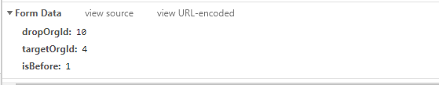

## axios

介绍一下axios默认get/post发送请求的数据格式

### get

因为get不需要设置Content-Type，直接拼接在url当中即可

```js
// 为给定 ID 的 user 创建请求
axios.get('/user?ID=12345')
  .then(function (response) {
    console.log(response);
  })
  .catch(function (error) {
    console.log(error);
  });

// 上面的请求也可以这样做
axios.get('/user', { // 最终也是/user?ID=12345
  params: {
    ID: 12345
  }
})
  .then(function (response) {
  console.log(response);
})
  .catch(function (error) {
  console.log(error);
});
```

### post

三种常见的 POST 提交数据方式

#### application/x-www-form-urlencoded

这应该是最常见的 POST 提交数据的方式了。浏览器的原生 <form> 表单，如果不设置 `enctype` 属性，那么最终就会以 application/x-www-form-urlencoded 方式提交数据。请求类似于下面这样（无关的请求头在本文中都省略掉了）：

network显示这种



chrome做了优化，解析之后进行展示的。

我们看一下解析之前的效果


基本就跟下面类似

```bash
POST http://www.example.com HTTP/1.1
Content-Type: application/x-www-form-urlencoded;charset=utf-8

dropOrgId=10&targetOrgId=4&isBefore=1


// 或者
POST http://www.example.com HTTP/1.1
Content-Type: application/x-www-form-urlencoded;charset=utf-8

title=test&sub%5B%5D=1&sub%5B%5D=2&sub%5B%5D=3
```

首先，Content-Type 被指定为 application/x-www-form-urlencoded；其次，提交的数据按照 key1=val1&key2=val2 的方式进行编码，key 和 val 都进行了 URL 转码。大部分服务端语言都对这种方式有很好的支持。例如 PHP 中，$_POST['title'] 可以获取到 title 的值，$_POST['sub'] 可以得到 sub 数组。

很多时候，我们用 Ajax 提交数据时，也是使用这种方式。例如 [JQuery](http://jquery.com/) 和 QWrap 的 Ajax，Content-Type 默认值都是「application/x-www-form-urlencoded;charset=utf-8」。

**axios使用方式**

```js
// 第一种在用到的地方使用
import axios from 'axios';
import qs from 'qs'
let data={name:'张三',age:18};
axios.post('url',qs.stringify(data))
.then(res=>{
	console.log('返回数据：',res)
})

// 第二种封装一个表单格式的axios实例
axios.create({
  baseURL: baseURL + process.env.VUE_APP_PROXY_PATH,
  timeout: 60000,
  transformRequest: [function (data) {
    console.log(data)
    data = qs.stringify(data)
    return data
  }]
})
```

#### multipart/form-data

这又是一个常见的 POST 数据提交的方式。我们使用**表单上传文件时**，必须让 <form> 表单的 `enctype` 等于 multipart/form-data。直接来看一个请求示例：

network显示这种

```bash
POST http://www.example.com HTTP/1.1
Content-Type:multipart/form-data; boundary=----WebKitFormBoundaryrGKCBY7qhFd3TrwA

------WebKitFormBoundaryrGKCBY7qhFd3TrwA
Content-Disposition: form-data; name="text"

title
------WebKitFormBoundaryrGKCBY7qhFd3TrwA
Content-Disposition: form-data; name="file"; filename="chrome.png"
Content-Type: image/png

PNG ... content of chrome.png ...
------WebKitFormBoundaryrGKCBY7qhFd3TrwA--
```

axios使用方式

```js
import axios from 'axios';
let data=new FormData();
data.append('name','张三');
data.append('age',18);
axios.post('url',data)
.then(res=>{
	console.log('返回数据：',res)
})
```

#### axios的默认类型application/json

**axios默认的提交方式。**如果使用这种编码方式，那么传递到后台的将是序列化后的json字符串。

```js
import axios from 'axios';
let data={
  conditionJson: JSON.stringify([{"xxxxxxxx"}])
  currentPage: 1,
  pageNow: 40
};
axios.post('url',data)
.then(res=>{
	console.log('返回数据：',res)
})

```

network显示


实际编码成

```bash
POST http://www.example.com HTTP/1.1 
Content-Type: application/json;charset=utf-8

{"title":"test","sub":[1,2,3]}
```

#### qs.stringify和JSON.stringify的使用和区别

qs可通过**`npm install qs`**命令进行安装，是一个npm仓库所管理的包。

而qs.stringify()将对象 序列化成URL的形式，以&进行拼接。

JSON是正常类型的JSON，请对比一下输出

```js
var a = {name:'hehe',age:10};
 qs.stringify(a)
// 'name=hehe&age=10'
JSON.stringify(a)
// '{"name":"hehe","age":10}'
```

## 参考资料

[四种常见的 POST 提交数据方式](https://imququ.com/post/four-ways-to-post-data-in-http.html)

[axios如何使用application/x-www-form-urlencoded format](http://www.axios-js.com/zh-cn/docs/#%E4%BD%BF%E7%94%A8-application-x-www-form-urlencoded-format)

[MIME 类型](https://developer.mozilla.org/zh-CN/docs/Web/HTTP/Basics_of_HTTP/MIME_types)

