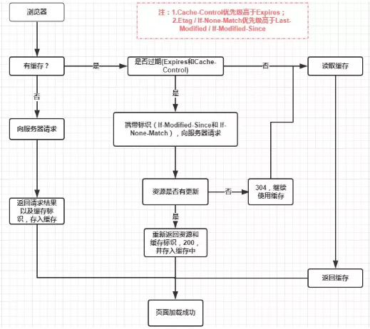

## 001.DNS是如何解析得到IP的？

比如访问“www.baidu.com”，就要进行下面三次查询

1. 先访问根域名服务器查询“com”顶级域名服务器在哪
2. 然后访问“com”顶级域名服务器，“baidu.com”域名服务器在哪
3. 最后再访问“baidu.com”域名服务器，拿到“www.baidu.com”的IP

为了缓解DNS服务器压力，通常使用缓存，两种思路：

1. 许多公司就近建立自己的DNS服务器，作为DNS代理的查询，代替用户访问核心DNS服务器，可以缓存之前的结果，有了这些结果直接返回IP地址给用户。比如Google的"8.8.8.8"，Microsoft的“4.2.2.1”等。
2. 操作系统也会做DNS解析结果的缓存，比如之前访问过“www.apple.com”，那下一次直接从操作系统拿IP了
3. 如果操作系统缓存的没有DNS记录还有可以找到一个主机映射文件，在 Windows 里是“C:\WINDOWS\system32\drivers\etc\hosts”，如果操作系统在缓存里找不到 DNS 记录，就会找这个文件。

## 002.HTTP 报文结构是怎么样的？


HTTP是`header + body`的结构，具体而言：

```
起始行 + 头部 + 空行 + 实体
```

因为请求报文和响应报文是由一定区别的，我们分开介绍。

### 起始行

对于请求报文，起始行一般长这样

```tex
POST /serv/v1/xxxx HTTP/1.1
```

也就是**方法 + 路径 + http版本**。

而响应报文是这样

```text
HTTP/1.1 200 OK
```

响应报文起始行也叫状态行，表示服务器响应的状态，由**http版本 + 状态码 + 原因**三部分组成。

值得注意的是，在起始行中，每两个部分之间用**空格**隔开，最后一个部分后面应该接一个**换行**，严格遵循`ABNF`语法规范。

### 头部


### 空行

同样很重要，用来区分`头部`和`实体`。

**问题：如果拼 HTTP 报文的时候，在头字段后多加了一个 CRLF，导致出现了一个空行，会发生什么？**

空行后面的部分会当做实体。

### 实体

就是具体的数据，也就是`body`部分。

## 003. 如何理解HTTP请求方法？

### 有哪些请求方法？

`http/1.1`规定了以下8种方法，（注意，都是大写的形式）：

1. GET：通常用来获取资源。
2. HEAD：获取资源的元信息，（只传回响应头，`HEAD` 方法的响应不应包含响应正文）。
3. POST：通常提交数据，即上传数据。
4. PUT：修改数据。
5. DELETE：删除资源（几乎用不到）。
6. CONNECT：建立特殊的连接隧道。
7. OPTIONS：列出可对资源实行的方法，（跨域的预检请求，检测服务器支持哪些 HTTP 方法）。
8. RACE：追踪请求 - 响应的传输路径。

### GET和POST有哪些区别？

最直观的语义区别，一个查询另一个新增资源。

还有一些具体的差别：

- 从**缓存**的角度，GET请求会被浏览器主动缓存下来，而POST默认不会缓存。
- 从**编码**的角度，GET请求只能进行URL编码也就是ASCII字符，而POST没有限制。（具体看下方分析）
- 从**安全**角度，GET请求拼接在URL中，因此不安全，POST放在请求当中，适合传输敏感信息。
- 从**幂等性**角度，`GET`是幂等的，而`POST`不是。（**幂等**表示执行相同的操作，结果也是相同的，GET请求一般查询结果只要参数相同，结果也相同，而POST一般意味着新增，参数相同也可能会新增数据）。
- 从**TCP**的角度，GET 请求会把请求报文一次性发出去，而 POST 会分为两个 TCP 数据包，首先发 header 部分，如果服务器响应 100(continue)， 然后发 body 部分。(**火狐**浏览器除外，它的 POST 请求只发一个 TCP 包)

### GET请求为什么要进行URL编码？

1. 会引起歧义，比如`name=P&G&age=25`。其中P&G表示的是一个name，并不是以`&`分割的键值对，因此为了避免这种歧义，就要进行编码，例如编码的符号有`&、=`。
2. 非法字符：URL 的编码格式采用的是 ASCII 码，而不是 Unicode，这也就是说你不能在 URL 中包含任何非 ASCII 字符，例如中文。否则如果客户端浏览器和服务端浏览器支持的字符集不同的情况下，中文可能会造成问题。

name如何编码：`escape、encodeURI、encodeURIComponent`，如果使用`axios`，默认已经进行GET请求进行编码。

### 为什么POST请求编码没有限制？

因为`Content-Type`字段表示数据类型，post请求可以提交**json类型，表单类型，文件类型**等。具体看：[请求-xhr-fetch-axios](https://github.com/wangshaojie98/Daily-Learning/blob/main/js/docs/10-%E8%AF%B7%E6%B1%82-xhr-fetch-axios.md)

### 如果让你用请求完成增删改查，你会使用那些方法？

- 增：POST
- 删：DELETE
- 改：PUT
- 查：GET

## 004. 如何理解HTTP状态码？

- **1xx**: 表示目前是协议处理的中间状态，还需要后续操作。
- **2xx**: 表示成功状态。
- **3xx**: 重定向状态，资源位置发生变动，需要重新请求。
- **4xx**: 请求报文有误。
- **5xx**: 服务器端发生错误。

### 1xx

**101 Switching Protocols**。在`HTTP`升级为`WebSocket`的时候，如果服务器同意变更，就会发送状态码 101。

### 2xx

**200 OK**成功状态码。通常在响应体放有数据。

**204 No Content**含义与 200 相同，但响应头后没有 body 数据。

**206 Partial Content**顾名思义，表示部分内容，场景是HTTP分块下载和断点续传，当然也会带上响应头字段`Content-Range`

### 3xx

**301 Moved Permanently**即永久重定向

**302 Found **临时重定向

比如你的网站从www.a.com换到www.high.com，或者从http升级到https，就应该返回301表示永久重定向，这样浏览器会做缓存，下次访问a.com的时候自动访问重定向那个地址。（重定向要带有location字段）

如果只是服务器升级，暂时访问一个代理域名上，返回302即可，浏览器不会做缓存。（重定向要带有location字段）


**304 NotModified**：当缓存命中会返回这个状态码。详见浏览器缓存

### 4xx

**400 Bad Request**: 开发者经常看到一头雾水，只是笼统地提示了一下错误，并不知道哪里出错了。

**403 Forbidden**: 这实际上并不是请求报文出错，而是服务器禁止访问，原因有很多，比如法律禁止、信息敏感。

**404 Not Found**: 资源未找到，表示没在服务器上找到相应的资源。（可能路径书写有误）

**405 Method Not Allowed**: 请求方法不被服务器端允许。

**406 Not Acceptable**: 资源无法满足客户端的条件。

**408 Request Timeout**: 服务器等待了太长时间。

**409 Conflict**: 多个请求发生了冲突。

**413 Request Entity Too Large**: 请求体的数据过大。

**414 Request-URI Too Long**: 请求行里的 URI 太大。

**429 Too Many Request**: 客户端发送的请求过多。

**431 Request Header Fields Too Large**请求头的字段内容太大。

### 5xx

**500 Internal Server Error**: 仅仅告诉你服务器出错了，出了啥错咱也不知道。

**501 Not Implemented**: 表示客户端请求的功能还不支持。

**502 Bad Gateway**: 服务器自身是正常的，但访问的时候出错了，啥错误咱也不知道。

**503 Service Unavailable**: 表示服务器当前很忙，暂时无法响应服务。

## 005. 对http头字段了解多少？

对于`Accept`系列字段的介绍分为四个部分: **数据格式**、**压缩方式**、**支持语言**和**字符集**。

### 数据类型与编码(MIME type)

对于http的特点之一数据类型非常多，那么到达服务端之后，怎么判断它的类型呢？

当然，数据都是有固定格式的，可以根据前几个字节进行猜它是文本，还是GIF图片。不想猜可以吗？

**MIME（Multipurpose Internet Mail Extensions）多用途互联网邮件扩展**，早起在电子邮件系统中使用，让电子邮件可以发送 ASCII 码以外的任意数据，后来HTTP截取一部分代表HTTP Body 部分的数据类型，具体体现在`Content-Type`字段，当然这是针对于发送端而言，接收端想要收到特定类型的数据，可以用`Accep`这个字段。

具体而言，这两个字段可以取下面的值：

1. text：即文本格式的可读数据，我们最熟悉的应该就是 text/html 了，表示超文本文档，此外还有纯文本 text/plain、样式表 text/css 等。
2. image：即图像文件，有 image/gif、image/jpeg、image/png 等。
3. audio/video：音频和视频数据，例如 audio/mpeg、video/mp4 等。
4. application：数据格式不固定，可能是文本也可能是二进制，必须由上层应用程序来解释。常见的有 application/json，application/javascript、application/pdf 等，另外，如果实在是不知道数据是什么类型，像刚才说的“黑盒”，就会是 application/octet-stream，即不透明的二进制数据。

```text
// 发送端
Content-Type: text/html

// 接收端
Accept: text/html,application/xml,image/webp,image/png
```

### 压缩方式(Encoding type )

当然一般这些数据都是会进行编码压缩的，采取什么样的压缩方式就体现在了发送方的`Content-Encoding`字段上， 同样的，接收什么样的压缩方式体现在了接受方的`Accept-Encoding`字段上。这个字段的取值有下面几种：

- gzip: 当今最流行的压缩格式
- deflate: 另外一种著名的压缩格式
- br: 一种专门为 HTTP 发明的压缩算法

```
// 发送方
Content-Encoding: gzip

// 接收方
Accpet-Encoding: gzip,deflate, br
```

### 语言类型

对于发送方而言，还有一个`Content-Language`字段，在需要实现国际化的方案当中，可以用来指定支持的语言，在接受方对应的字段为`Accept-Language`。如:

```
// 接收端
Accept-Language: zh-CN, zh, en

// 发送端
Content-Language: zh-CN
```

### 字符集

比较特殊，接收端有对应的字段，而发送端没有，而是直接放到`Content-Type`中了，以chartset属性指定。

```
// 发送端
Content-Type: text/html; charset=utf-8
// 接收端
Accept-Charset: charset=utf-8
```

最后看一张图吧


## 006. 对于定长和不定长的数据，HTTP怎么传输的？

### 定长数据

对于定长包体，发送端在传输时使用`Content-Length`设置传输的长度。

```js
const http = require('http');

const server = http.createServer();

server.on('request', (req, res) => {
  if(req.url === '/') {
    res.setHeader('Content-Type', 'text/plain');
    res.setHeader('Content-Length', 10);
    res.write("helloworld");
  }
})

server.listen(8081, () => {
  console.log("成功启动");
})
```

启动后访问: **localhost:8081**。

浏览器中显示如下:

```
helloworld
```

这是长度正确的情况，那不正确的情况是如何处理的呢？

我们试着把这个长度设置的小一些:

```js
res.setHeader('Content-Length', 8);
```

重启服务，再次访问，现在浏览器中内容如下:

```
hellowor
```

那后面的`ld`哪里去了呢？实际上在 http 的响应体中直接被截去了。

然后我们试着将这个长度设置得大一些:

```js
res.setHeader('Content-Length', 12);
```

此时浏览器显示如下:


直接无法显示了。可以看到`Content-Length`对于 http 传输过程起到了十分关键的作用，如果设置不当可以直接导致传输失败。

### 不定长数据

上述是针对于`定长包体`，那么对于`不定长包体`而言是如何传输的呢？

这里就必须介绍另外一个 http 头部字段了:

```
Transfer-Encoding: chunked
复制代码
```

表示分块传输数据，设置这个字段后会自动产生两个效果:

- Content-Length 字段会被忽略
- 基于长连接持续推送动态内容

我们依然以一个实际的例子来模拟分块传输，nodejs 程序如下:

```js
const http = require('http');

const server = http.createServer();

server.on('request', (req, res) => {
  if(req.url === '/') {
    res.setHeader('Content-Type', 'text/html; charset=utf8');
    res.setHeader('Content-Length', 10);
    res.setHeader('Transfer-Encoding', 'chunked');
    res.write("<p>来啦</p>");
    setTimeout(() => {
      res.write("第一次传输<br/>");
    }, 1000);
    setTimeout(() => {
      res.write("第二次传输");
      res.end()
    }, 2000);
  }
})

server.listen(8009, () => {
  console.log("成功启动");
})
```

效果：


用 telnet 抓到的响应如下:


注意，`Connection: keep-alive`及之前的为响应行和响应头，后面的内容为响应体，这两部分用换行符隔开。

响应体的结构比较有意思，如下所示:

```
chunk长度(16进制的数)
第一个chunk的内容
chunk长度(16进制的数)
第二个chunk的内容
......
0

```

最后是留有有一个`空行`的，这一点请大家注意。

以上便是 http 对于**定长数据**和**不定长数据**的传输方式。

## 007. HTTP1.1 如何解决 HTTP 的队头阻塞问题？

### 什么是 HTTP 队头阻塞？

从前面的小节可以知道，HTTP 传输是基于`请求-应答`的模式进行的，报文必须是一发一收，但值得注意的是，里面的任务被放在一个任务队列中串行执行，一旦队首的请求处理太慢，就会阻塞后面请求的处理。这就是著名的`HTTP队头阻塞`问题。

### 并发连接

对于一个域名允许分配多个长连接，那么相当于增加了任务队列，不至于一个队伍的任务阻塞其它所有任务。在RFC2616规定过客户端最多并发 2 个连接，不过事实上在现在的浏览器标准中，这个上限要多很多，Chrome 中是 6 个。

但其实，即使是提高了并发连接，还是不能满足人们对性能的需求。

### 域名分片

一个域名不是可以并发 6 个长连接吗？那我就多分几个域名。

比如 content1.sanyuan.com 、content2.sanyuan.com。

这样一个`sanyuan.com`域名下可以分出非常多的二级域名，而它们都指向同样的一台服务器，能够并发的长连接数更多了，事实上也更好地解决了队头阻塞的问题。

## 008. 如何理解HTTP缓存以及缓存代理？

为什么设置cache-contorl之后，刷新浏览器还看不到缓存标识，比如`from memory`等？缓存的重要一环是浏览器，常见浏览器行为对应的缓存行为有哪些呢？

已经解决了，是刷新的问题。手动刷新按F5会强制浏览器走服务器，只要在新窗口重新打开当前页面就能看到`200 (from cache)`了，或者自动跳转也行。

- 当用户 Ctrl + F5 强制刷新网页时，浏览器直接从服务器加载，跳过强缓存和协商缓存
- 当用户仅仅敲击 F5 刷新网页时，跳过强缓存，但是仍然会进行协商缓存过程

下面借用 Alloy Team 的图进行总结：


```
max-age=<seconds>
```

设置缓存存储的最大周期，超过这个时间缓存被认为过期(单位秒)。与`Expires`相反，时间是相对于请求的时间。

### 强缓存

浏览器中的缓存作用分为两种情况，一种是需要发送`HTTP`请求，一种是不需要发送。

首先是检查强缓存，这个阶段`不需要`发送HTTP请求。

如何来检查呢？通过相应的字段来进行，但是说起这个字段就有点门道了。

在`HTTP/1.0`和`HTTP/1.1`当中，这个字段是不一样的。在早期，也就是`HTTP/1.0`时期，使用的是**Expires**，而`HTTP/1.1`使用的是**Cache-Control**。让我们首先来看看Expires。

#### Expires

`Expires`即过期时间，存在于服务端返回的响应头中，告诉浏览器在这个过期时间之前可以直接从缓存里面获取数据，无需再次请求。比如下面这样:

```js
Expires: Wed, 22 Nov 2019 08:41:00 GMT
```

表示资源在`2019年11月22号8点41分`过期，过期了就得向服务端发请求。

这个方式看上去没什么问题，合情合理，但其实潜藏了一个坑，那就是**服务器的时间和浏览器的时间可能并不一致**，那服务器返回的这个过期时间可能就是不准确的。因此这种方式很快在后来的HTTP1.1版本中被抛弃了。

#### Cache-Control

在HTTP1.1中，采用了一个非常关键的字段：`Cache-Control`。这个字段也是存在于

它和`Expires`本质的不同在于它并没有采用`具体的过期时间点`这个方式，而是采用过期时长来控制缓存，对应的字段是**max-age**。比如这个例子:

```js
Cache-Control:max-age=3600
```

代表这个响应返回后在 3600 秒，也就是一个小时之内可以直接使用缓存。

如果你觉得它只有`max-age`一个属性的话，那就大错特错了。

它其实可以组合非常多的指令，完成更多场景的缓存判断, 将一些关键的属性列举如下: **public**: 客户端和代理服务器都可以缓存。因为一个请求可能要经过不同的`代理服务器`最后才到达目标服务器，那么结果就是不仅仅浏览器可以缓存数据，中间的任何代理节点都可以进行缓存。

**private**： 这种情况就是只有浏览器能缓存了，中间的代理服务器不能缓存。

**no-cache**: 跳过当前的强缓存，发送HTTP请求，即直接进入`协商缓存阶段`。

**no-store**：非常粗暴，不进行任何形式的缓存。

**s-maxage**：这和`max-age`长得比较像，但是区别在于s-maxage是针对代理服务器的缓存时间。

**must-revalidate**: 是缓存就会有过期的时候，加上这个字段一旦缓存过期，就必须回到源服务器验证。

值得注意的是，当**Expires**和**Cache-Control**同时存在的时候，**Cache-Control**会优先考虑。

当然，还存在一种情况，当资源缓存时间超时了，也就是`强缓存`失效了，接下来怎么办？没错，这样就进入到第二级屏障——**协商缓存**了。

### 协商缓存

强缓存失效之后，浏览器在请求头中携带相应的`缓存tag`来向服务器发请求，由服务器根据这个tag，来决定是否使用缓存，这就是**协商缓存**。

具体来说，这样的缓存tag分为两种: **Last-Modified** 和 **ETag**。这两者各有优劣，并不存在谁对谁有`绝对的优势`，跟上面强缓存的两个 tag 不一样。

#### Last-Modified

即最后修改时间。在浏览器第一次给服务器发送请求后，服务器会在响应头中加上这个字段。

浏览器接收到后，如果再次请求，会在请求头中携带`If-Modified-Since`字段，这个字段的值也就是服务器传来的最后修改时间。

服务器拿到请求头中的`If-Modified-Since`的字段后，其实会和这个服务器中`该资源的最后修改时间`对比:

- 如果请求头中的这个值小于最后修改时间，说明是时候更新了。返回新的资源，跟常规的HTTP请求响应的流程一样。
- 否则返回304，告诉浏览器直接用缓存。

#### ETag

`ETag` 是服务器根据当前文件的内容，给文件生成的唯一标识，只要里面的内容有改动，这个值就会变。服务器通过`响应头`把这个值给浏览器。

浏览器接收到`ETag`的值，会在下次请求时，将这个值作为**If-None-Match**这个字段的内容，并放到请求头中，然后发给服务器。

服务器接收到**If-None-Match**后，会跟服务器上该资源的**ETag**进行比对:

- 如果两者不一样，说明要更新了。返回新的资源，跟常规的HTTP请求响应的流程一样。
- 否则返回304，告诉浏览器直接用缓存。

我们看看强缓存和协商缓存的流程：



### 两者对比

1. 在`精准度`上，`ETag`优于`Last-Modified`。优于 ETag 是按照内容给资源上标识，因此能准确感知资源的变化。而 Last-Modified 就不一样了，它在一些特殊的情况并不能准确感知资源变化，主要有两种情况:

- 编辑了资源文件，但是文件内容并没有更改，这样也会造成缓存失效。
- Last-Modified 能够感知的单位时间是秒，如果文件在 1 秒内改变了多次，那么这时候的 Last-Modified 并没有体现出修改了。

1. 在性能上，`Last-Modified`优于`ETag`，也很简单理解，`Last-Modified`仅仅只是记录一个时间点，而 `Etag`需要根据文件的具体内容生成哈希值。

另外，如果两种方式都支持的话，服务器会优先考虑`ETag`。

### 频繁变动的资源

```text
Cache-Control: no-cache
```

对于频繁变动的资源，首先需要使用`Cache-Control: no-cache` 使浏览器每次都请求服务器，然后配合 ETag 或者 Last-Modified 来验证资源是否有效。这样的做法虽然不能节省请求数量，但是能显著减少响应数据大小。

### 不常变化的资源

```text
Cache-Control: max-age=31536000
```

通常在处理这类资源时，给它们的 Cache-Control 配置一个很大的 `max-age=31536000` (一年)，这样浏览器之后请求相同的 URL 会命中强制缓存。而为了解决更新的问题，就需要在文件名(或者路径)中添加 hash， 版本号等动态字符，之后更改动态字符，从而达到更改引用 URL 的目的，让之前的强制缓存失效 (其实并未立即失效，只是不再使用了而已)。

## 009. 什么是跨域？浏览器如何拦截响应？如何解决？

在前后端分离的开发模式中，经常会遇到跨域问题，即 Ajax 请求发出去了，服务器也成功响应了，前端就是拿不到这个响应。接下来我们就来好好讨论一下这个问题。

### 什么是跨域

回顾一下 URI 的组成:


浏览器遵循**同源政策**(`scheme(协议)`、`host(主机)`和`port(端口)`都相同则为`同源`)。非同源站点有这样一些限制:

- 不能读取和修改对方的 DOM
- 不读访问对方的 Cookie、IndexDB 和 LocalStorage
- 限制 XMLHttpRequest 请求。(后面的话题着重围绕这个)

当浏览器向目标 URI 发 Ajax 请求时，只要当前 URL 和目标 URL 不同源，则产生跨域，被称为`跨域请求`。

跨域请求的响应一般会被浏览器所拦截，注意，是被浏览器拦截，响应其实是成功到达客户端了。那这个拦截是如何发生呢？

首先要知道的是，浏览器是多进程的，以 Chrome 为例，进程组成如下：


**WebKit 渲染引擎**和**V8 引擎**都在渲染进程当中。

当`xhr.send`被调用，即 Ajax 请求准备发送的时候，其实还只是在渲染进程的处理。为了防止黑客通过脚本触碰到系统资源，浏览器将每一个渲染进程装进了沙箱，并且为了防止 CPU 芯片一直存在的**Spectre** 和 **Meltdown**漏洞，采取了`站点隔离`的手段，给每一个不同的站点(一级域名不同)分配了沙箱，互不干扰。具体见[YouTube上Chromium安全团队的演讲视频](https://www.youtube.com/watch?v=dBuykrdhK-A&feature=emb_logo)。

在沙箱当中的渲染进程是没有办法发送网络请求的，那怎么办？只能通过网络进程来发送。那这样就涉及到进程间通信(IPC，Inter Process Communication)了。接下来我们看看 chromium 当中进程间通信是如何完成的，在 chromium 源码中调用顺序如下:


可能看了你会比较懵，如果想深入了解可以去看看 chromium 最新的源代码，[IPC源码地址](https://chromium.googlesource.com/chromium/src/+/refs/heads/master/ipc/)及[Chromium IPC源码解析文章](https://blog.csdn.net/Luoshengyang/article/details/47822689)。

总的来说就是利用`Unix Domain Socket`套接字，配合事件驱动的高性能网络并发库`libevent`完成进程的 IPC 过程。

好，现在数据传递给了浏览器主进程，主进程接收到后，才真正地发出相应的网络请求。

在服务端处理完数据后，将响应返回，主进程检查到跨域，且没有cors(后面会详细说)响应头，将响应体全部丢掉，并不会发送给渲染进程。这就达到了拦截数据的目的。

接下来我们来说一说解决跨域问题的几种方案。

### CORS

CORS 其实是 W3C 的一个标准，全称是`跨域资源共享`。它需要浏览器和服务器的共同支持，具体来说，非 IE 和 IE10 以上支持CORS，服务器需要附加特定的响应头，后面具体拆解。不过在弄清楚 CORS 的原理之前，我们需要清楚两个概念: **简单请求**和**非简单请求**。

浏览器根据请求方法和请求头的特定字段，将请求做了一下分类，具体来说规则是这样，凡是满足下面条件的属于**简单请求**:

- 请求方法为 GET、POST 或者 HEAD
- 请求头的取值范围: Accept、Accept-Language、Content-Language、Content-Type(只限于三个值`application/x-www-form-urlencoded`、`multipart/form-data`、`text/plain`)

浏览器画了这样一个圈，在这个圈里面的就是**简单请求**, 圈外面的就是**非简单请求**，然后针对这两种不同的请求进行不同的处理。

#### 简单请求

请求发出去之前，浏览器做了什么？

它会自动在请求头当中，添加一个`Origin`字段，用来说明请求来自哪个`源`。服务器拿到请求之后，在回应时对应地添加`Access-Control-Allow-Origin`字段，如果`Origin`不在这个字段的范围中，那么浏览器就会将响应拦截。

因此，`Access-Control-Allow-Origin`字段是服务器用来决定浏览器是否拦截这个响应，这是必需的字段。与此同时，其它一些可选的功能性的字段，用来描述如果不会拦截，这些字段将会发挥各自的作用。

**Access-Control-Allow-Credentials**。这个字段是一个布尔值，表示是否允许发送 Cookie，对于跨域请求，浏览器对这个字段默认值设为 false，而如果需要拿到浏览器的 Cookie，需要添加这个响应头并设为`true`, 并且在前端也需要设置`withCredentials`属性:

```
let xhr = new XMLHttpRequest();
xhr.withCredentials = true;
复制代码
```

**Access-Control-Expose-Headers**。这个字段是给 XMLHttpRequest 对象赋能，让它不仅可以拿到基本的 6 个响应头字段（包括`Cache-Control`、`Content-Language`、`Content-Type`、`Expires`、`Last-Modified`和`Pragma`）, 还能拿到这个字段声明的**响应头字段**。比如这样设置:

```
Access-Control-Expose-Headers: aaa
复制代码
```

那么在前端可以通过 `XMLHttpRequest.getResponseHeader('aaa')` 拿到 `aaa` 这个字段的值。

#### 非简单请求

非简单请求相对而言会有些不同，体现在两个方面: **预检请求**和**响应字段**。

我们以 PUT 方法为例。

```
var url = 'http://xxx.com';
var xhr = new XMLHttpRequest();
xhr.open('PUT', url, true);
xhr.setRequestHeader('X-Custom-Header', 'xxx');
xhr.send();
复制代码
```

当这段代码执行后，首先会发送**预检请求**。这个预检请求的请求行和请求体是下面这个格式:

```
OPTIONS / HTTP/1.1
Origin: 当前地址
Host: xxx.com
Access-Control-Request-Method: PUT
Access-Control-Request-Headers: X-Custom-Header
复制代码
```

预检请求的方法是`OPTIONS`，同时会加上`Origin`源地址和`Host`目标地址，这很简单。同时也会加上两个关键的字段:

- Access-Control-Request-Method, 列出 CORS 请求用到哪个HTTP方法
- Access-Control-Request-Headers，指定 CORS 请求将要加上什么请求头

这是`预检请求`。接下来是**响应字段**，响应字段也分为两部分，一部分是对于**预检请求**的响应，一部分是对于 **CORS 请求**的响应。

**预检请求的响应**。如下面的格式:

```
HTTP/1.1 200 OK
Access-Control-Allow-Origin: *
Access-Control-Allow-Methods: GET, POST, PUT
Access-Control-Allow-Headers: X-Custom-Header
Access-Control-Allow-Credentials: true
Access-Control-Max-Age: 1728000
Content-Type: text/html; charset=utf-8
Content-Encoding: gzip
Content-Length: 0
复制代码
```

其中有这样几个关键的**响应头字段**:

- Access-Control-Allow-Origin: 表示可以允许请求的源，可以填具体的源名，也可以填`*`表示允许任意源请求。
- Access-Control-Allow-Methods: 表示允许的请求方法列表。
- Access-Control-Allow-Credentials: 简单请求中已经介绍。
- Access-Control-Allow-Headers: 表示允许发送的请求头字段
- Access-Control-Max-Age: 预检请求的有效期，在此期间，不用发出另外一条预检请求。

在预检请求的响应返回后，如果请求不满足响应头的条件，则触发`XMLHttpRequest`的`onerror`方法，当然后面真正的**CORS请求**也不会发出去了。

**CORS 请求的响应**。绕了这么一大转，到了真正的 CORS 请求就容易多了，现在它和**简单请求**的情况是一样的。浏览器自动加上`Origin`字段，服务端响应头返回**Access-Control-Allow-Origin**。可以参考以上简单请求部分的内容。

### JSONP

虽然`XMLHttpRequest`对象遵循同源政策，但是`script`标签不一样，它可以通过 src 填上目标地址从而发出 GET 请求，实现跨域请求并拿到响应。这也就是 JSONP 的原理，接下来我们就来封装一个 JSONP:

```
const jsonp = ({ url, params, callbackName }) => {
  const generateURL = () => {
    let dataStr = '';
    for(let key in params) {
      dataStr += `${key}=${params[key]}&`;
    }
    dataStr += `callback=${callbackName}`;
    return `${url}?${dataStr}`;
  };
  return new Promise((resolve, reject) => {
    // 初始化回调函数名称
    callbackName = callbackName || Math.random().toString.replace(',', ''); 
    // 创建 script 元素并加入到当前文档中
    let scriptEle = document.createElement('script');
    scriptEle.src = generateURL();
    document.body.appendChild(scriptEle);
    // 绑定到 window 上，为了后面调用
    window[callbackName] = (data) => {
      resolve(data);
      // script 执行完了，成为无用元素，需要清除
      document.body.removeChild(scriptEle);
    }
  });
}
复制代码
```

当然在服务端也会有响应的操作, 以 express 为例:

```
let express = require('express')
let app = express()
app.get('/', function(req, res) {
  let { a, b, callback } = req.query
  console.log(a); // 1
  console.log(b); // 2
  // 注意哦，返回给script标签，浏览器直接把这部分字符串执行
  res.end(`${callback}('数据包')`);
})
app.listen(3000)
复制代码
```

前端这样简单地调用一下就好了:

```
jsonp({
  url: 'http://localhost:3000',
  params: { 
    a: 1,
    b: 2
  }
}).then(data => {
  // 拿到数据进行处理
  console.log(data); // 数据包
})
复制代码
```

和`CORS`相比，JSONP 最大的优势在于兼容性好，IE 低版本不能使用 CORS 但可以使用 JSONP，缺点也很明显，请求方法单一，只支持 GET 请求。

### Nginx

Nginx 是一种高性能的`反向代理`服务器，可以用来轻松解决跨域问题。

what？反向代理？我给你看一张图你就懂了。


正向代理帮助客户端**访问**客户端自己访问不到的服务器，然后将结果返回给客户端。

反向代理拿到客户端的请求，将请求转发给其他的服务器，主要的场景是维持服务器集群的**负载均衡**，换句话说，反向代理帮**其它的服务器**拿到请求，然后选择一个合适的服务器，将请求转交给它。

因此，两者的区别就很明显了，正向代理服务器是帮**客户端**做事情，而反向代理服务器是帮其它的**服务器**做事情。

好了，那 Nginx 是如何来解决跨域的呢？

比如说现在客户端的域名为**client.com**，服务器的域名为**server.com**，客户端向服务器发送 Ajax 请求，当然会跨域了，那这个时候让 Nginx 登场了，通过下面这个配置:

```
server {
  listen  80;
  server_name  client.com;
  location /api {
    proxy_pass server.com;
  }
}
复制代码
```

Nginx 相当于起了一个跳板机，这个跳板机的域名也是`client.com`，让客户端首先访问 `client.com/api`，这当然没有跨域，然后 Nginx 服务器作为反向代理，将请求转发给`server.com`，当响应返回时又将响应给到客户端，这就完成整个跨域请求的过程。

其实还有一些不太常用的方式，大家了解即可，比如`postMessage`，当然`WebSocket`也是一种方式，但是已经不属于 HTTP 的范畴，另外一些奇技淫巧就不建议大家去死记硬背了，一方面从来不用，名字都难得记住，另一方面临时背下来，面试官也不会对你印象加分，因为看得出来是背的。当然没有背并不代表减分，把跨域原理和前面三种主要的跨域方式理解清楚，经得起更深一步的推敲，反而会让别人觉得你是一个靠谱的人。